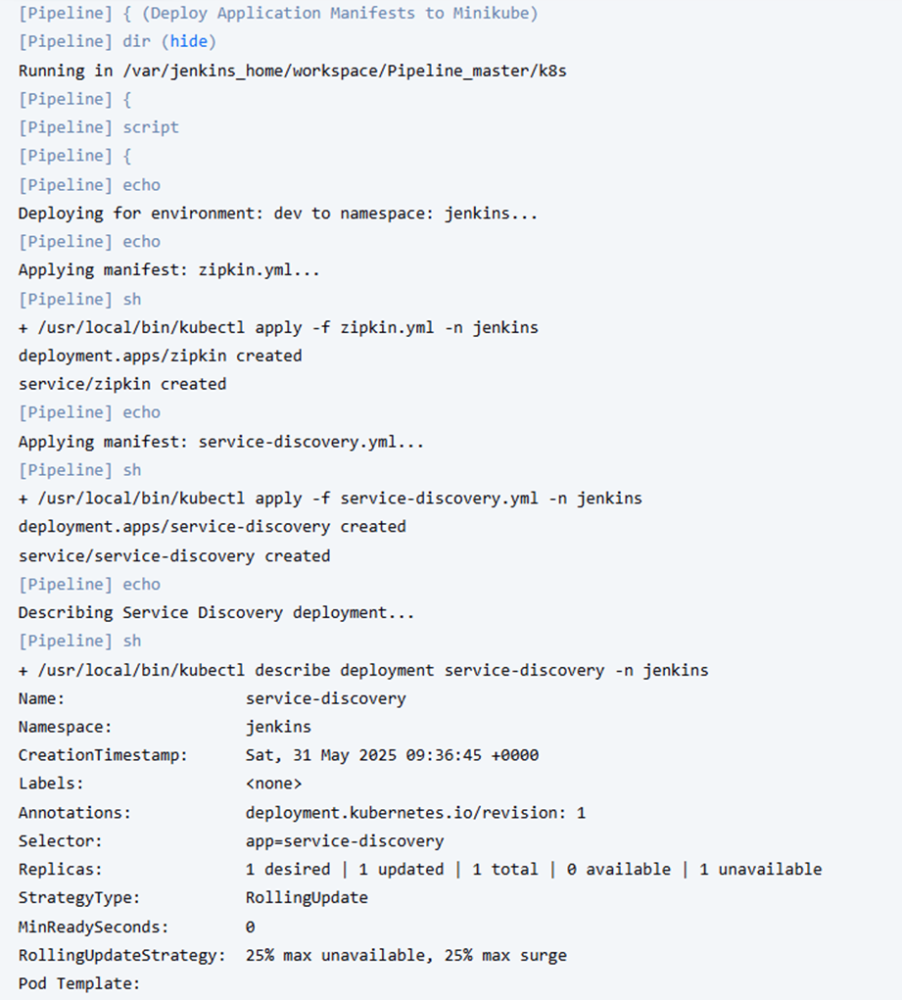
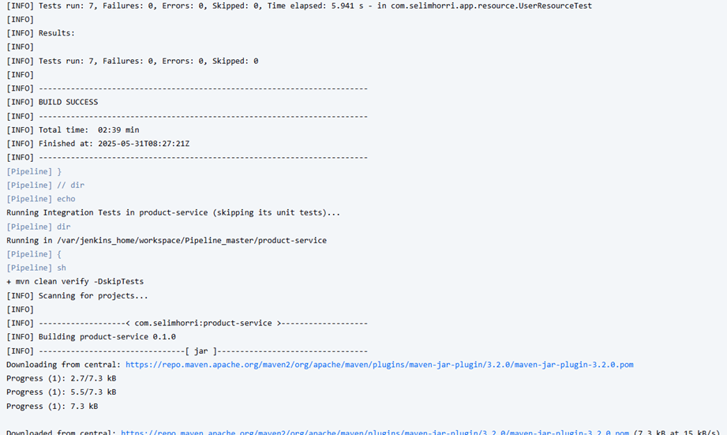
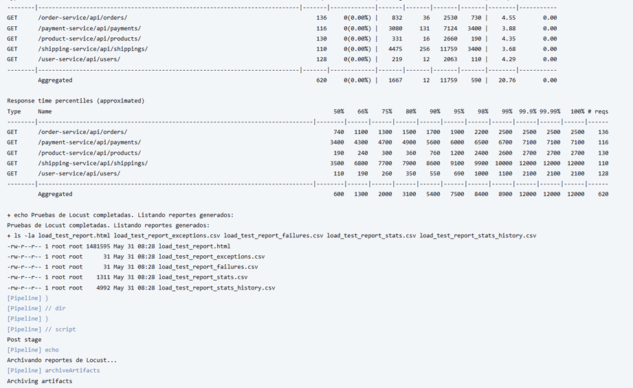
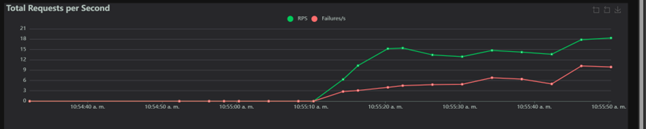
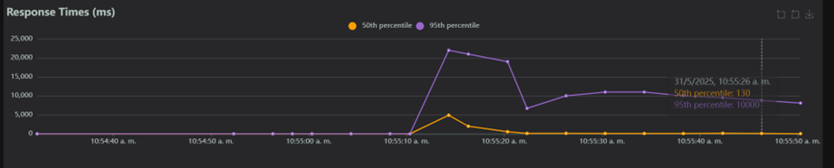

# Taller 2: Pruebas y lanzamiento

## 1. Introducción

Este documento presenta el desarrollo del Taller 2 de Ingeniería de Software v, enfocado en la implementación de pipelines CI/CD, pruebas automatizadas y despliegue de microservicios en Kubernetes. El proyecto se basa en una aplicación de e-commerce conformada por seis microservicios principales: `order`, `payment`, `product`, `user`, `favourite` y `shipping`, así como servicios esenciales como `zipkin`, `service discovery` y `cloud-config`.

---

## 2. Jenkinsfile y Entornos

Se implementó un Jenkinsfile en el que se definen tres entornos: `dev`, `stage` y `prod`. Cada uno realiza diferentes fases del pipeline como se pidio en el taller, desde el despliegue básico hasta pruebas y lanzamiento. Las herramientas empleadas incluyen Jenkins, Docker, Kubernetes (minikube), Postman (Newman) y Locust.

---

## 3. Pipeline por Entorno

### 3.1 Entorno Dev

#### Configuración

El entorno Dev despliega los servicios esenciales (zipkin, service discovery, cloud-config) y los microservicios principales usando archivos YAML en Kubernetes.

#### Resultado

Todos los pods fueron desplegados exitosamente en Kubernetes.

Este entorno se utiliza para validar el despliegue base sin ejecutar pruebas.

---

### 3.2 Entorno Stage

#### Configuración

Este entorno incluye ejecución de pruebas automatizadas: unitarias en **UserService**, integración en **ProductRepository**`, E2E con una colección de Postman y pruebas de estrés con Locust.

Verfificamos el ambiente para que se puedan ejecutar todas las pruebas correctamente.

Desplegamos los manifiestos:

Ejecutamos pruebas unitarias y de integración:

Pruebas E2E:

Por ultimo, pruebas de estrés con Locust:

Y termina la pipeline:

#### Resultado

Las pruebas unitarias, de integración, locust y E2E fueron ejecutadas exitosamente.

#### Análisis

* Las pruebas unitarias validan el controlador de usuario.
* Las pruebas de integración garantizan la operación sobre la base H2.
* Las pruebas E2E prueban flujos completos: crear usuario, producto, carrito, orden y pago.

---

### 3.3 Entorno Prod (Master)

#### Configuración

Este entorno repite el despliegue y ejecuta pruebas unitarias, de integración y E2E, además de generar Release Notes automáticas en el repositorio Git.

Antes de desplegar los manifiestos verificamos si estos no se estan ejecutando actualmente:

Realizamos pruebas unitarias y de integración:

Ejecutamos E2E:

Generamos Release Notes:

Quedan desplegadas en el repositorio de github:

#### Resultado

Despliegue exitoso, pruebas unitarias, de integración y E2E realizadas y release notes generadas.

## 4. Análisis de rendimiento locust fuera de la pipeline

Durante las pruebas de rendimiento se simularon **80 usuarios concurrentes**, con una tasa de llegada de **4 usuarios por segundo**.

##### Métricas observadas:

* **Total de solicitudes:** 659
* **Tasa de errores:** 42% (274 fallos)
* **Promedio de throughput (RPS):** 18.3 solicitudes por segundo
* **Pico de RPS:** 21
* **Tiempos de respuesta promedio por servicio:**

  * `/payment-service/api/payments`: 2738 ms
  * `/shipping-service/api/shippings`: 6638 ms
  * `/product-service/api/products`: 3438 ms
  * `/user-service/api/users`: 1428 ms
  * `/order-service/api/orders`: 1031 ms

##### Análisis gráfico:

**RPS:**

**RT:**

**Usuarios:**

* La gráfica de RPS muestra un crecimiento progresivo hasta alcanzar un pico de 21 req/s, estabilizándose cerca de los 18.
* La línea de fallos por segundo crece de manera proporcional, lo que indica que algunos servicios presentan **problemas de estabilidad o cuellos de botella bajo carga.
* La gráfica de percentiles de respuesta revela que el percentil 95 alcanzó hasta 22 segundos, siendo los picos más altos entre los segundos 10 y 25 del test. El percentil 50 se mantuvo bajo, alrededor de 130 ms, indicando que algunos usuarios experimentaron respuestas aceptables, pero hubo mucha variabilidad.
* La gráfica de **número de usuarios** muestra cómo se alcanzó y mantuvo la carga máxima de 80 usuarios durante el test.

##### Conclusión:

El sistema es capaz de manejar una carga moderada, pero **bajo condiciones de estrés presenta una tasa de error significativa**, especialmente en los servicios de shipping y payment, cuyos tiempos de respuesta y porcentaje de fallos fueron los más altos.

---

## 5. Release Notes

A continuación, se presenta un ejemplo de notas generadas automáticamente por el pipeline:

---

## 6. Conclusiones

Se logró automatizar el ciclo completo de desarrollo, pruebas y despliegue de la aplicación de e-commerce. Las pruebas garantizan la calidad del sistema, y el uso de pipelines mejora la eficiencia del equipo de desarrollo.

---

## 7. Anexos

Se Adjunta todo el proyecto en un .zip.

---